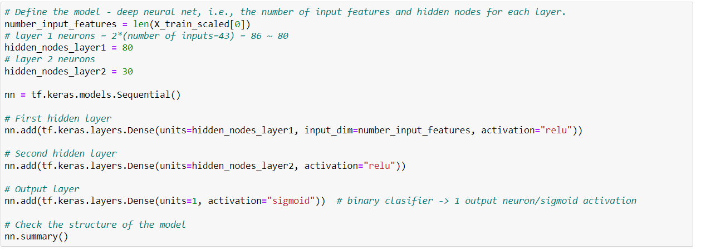
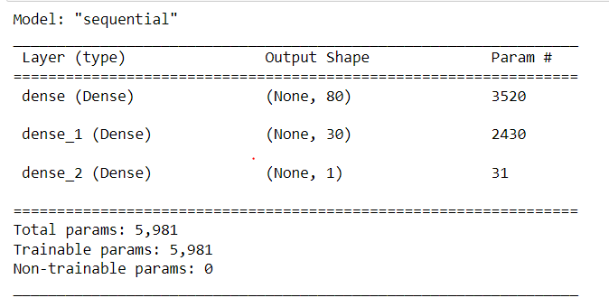

# Neural Network Charity Analysis

## Overview of the Analysis

This analysis was conducted to review charitable organizations and how they allocate their funds. Company, Alphabet Soup, is looking to make a donation, but the management is considering the how each charity uses the funds and what the biggest impact of the donation would be. 

## Results

The results of this analysis have been divided up into two sections: *Data Processing* and *Compiling, Training, and Evaluating the Model*. 

### Data Preprocessing
#### 1. What variable(s) are considered the target(s) for your model?
The target value for this model is the 'IS_SUCCESSFUL' column, as it gives insight on how successful the charitable organization is with their donations, i.e. how impactful a donation is. 

#### 2. What variable(s) are considered to be the features for your model?
Feature variables included:
- APPLICATION_TYPE
- AFFILIATION
- CLASSIFICATIONv
- USE_CASE	
- ORGANIZATION
- STATUS
- INCOME_AMT
- ASK_AMT

#### 3.What variable(s) are neither targets nor features, and should be removed from the input data?
Variables 'EIN' and 'NAME' have been dropped from the analysis, as they do not provide any further insight and provide too many classifications, which would create overfitting. As part of Deliverable 3, I have also removed 'SPECIAL_CONSIDERATIONS' as this column offers only a binary representation of "Yes" or "No" for whether companies had any special considerations. 

### Compiling, Training, and Evaluating the Model
#### 1. How many neurons, layers, and activation functions did you select for your neural network model, and why?
For deliverable 1 and 2, 2 neural networks were used, and an output layer also exists. The details are as follows:

With a result as follows:

For deliverable 3, I added a third layer and changed the number of neurons as follows: 

With results as follows:

#### 2. Were you able to achieve the target model performance?
I was not able to achieve an accuracy higher than 75%, however it did increase in comparison to Deliverable 1 & 2.

#### 3. What steps did you take to try and increase model performance?
To increase the model performance, I added an extra layer, and changed the neuron amounts. I had additionally tried to change the output activation function, however that negatively impacted the accuracy level so I kept it at *sigmoid*.

## Summary

Overall, the model ended with an accuracy level of 73% after optimization. I was unable to remove any other columns, as in my opinion they all added import feature values/ 

To increase the model's accuracy, more data could have been used. Otherwise, the Random Forest Classifiers model could instead have been used to achieve a higher accuracy score. The latter has a faster response time, and would have fit the data better rather than running into the issue of overfitting. 
